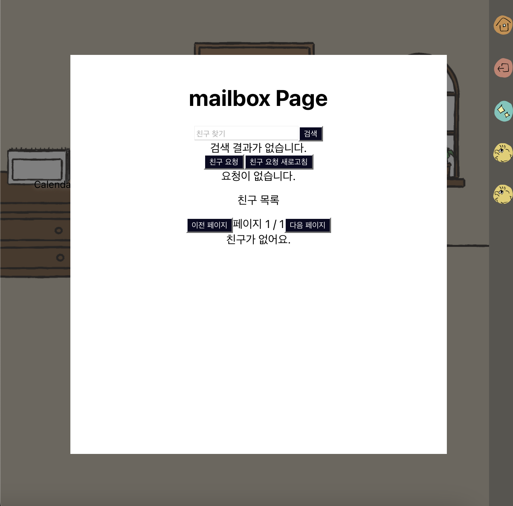

# FeatherTales 🪶

사용자만의 아바타를 만들고, 일기를 작성하며, 아늑한 집 테마의 환경에서 친구들과 소통할 수 있는 개인 공간 커스터마이징 프로젝트입니다.

## 🛠 기술 스택

- **프론트엔드**: React
- **백엔드**: Node.js
- **데이터베이스**: MongoDB

## ✨ 주요 기능

### 🏠 인터랙티브 홈 환경
- 클릭한 위치로 이동하는 아바타
- 아바타가 접근하면 나타나는 오브젝트 상호작용 버튼
- 사용자만의 개성을 반영할 수 있는 개인 공간

### 👤 아바타 커스터마이징
- 자유로운 아바타 커스터마이징 시스템
- 다양한 커스터마이징 옵션으로 나만의 캐릭터 생성

### 📚 책방 시스템
- 개인 글과 문서 작성 및 저장
- 사용자 지정 카테고리로 글 정리
- 드래그 앤 드롭으로 간편한 카테고리 관리
- 카테고리별 문서 필터링 및 조회

### 👥 친구 시스템
- 다른 사용자 검색
- 친구 요청 보내기/받기
- 친구 목록 관리
- 친구 추가/삭제 기능

## 🚀 현재 구현된 기능
- 로그인/회원가입
- 메인 인터랙티브 환경
- 아바타 커스터마이징
- 책방 시스템
- 친구 관리 시스템

## 🔮 향후 추가 예정 기능
- 방 디자인 커스터마이징
- 친구와의 상호작용 기능 강화
- 더 많은 인터랙티브 요소와 활동
- 디자인 수정

## 📸 추가 스크린샷

### 로그인/회원가입

### 아바타 동작 화면

---
_본 프로젝트는 현재 활발히 개발 중이며, 새로운 기능과 개선사항이 정기적으로 추가될 예정입니다._
